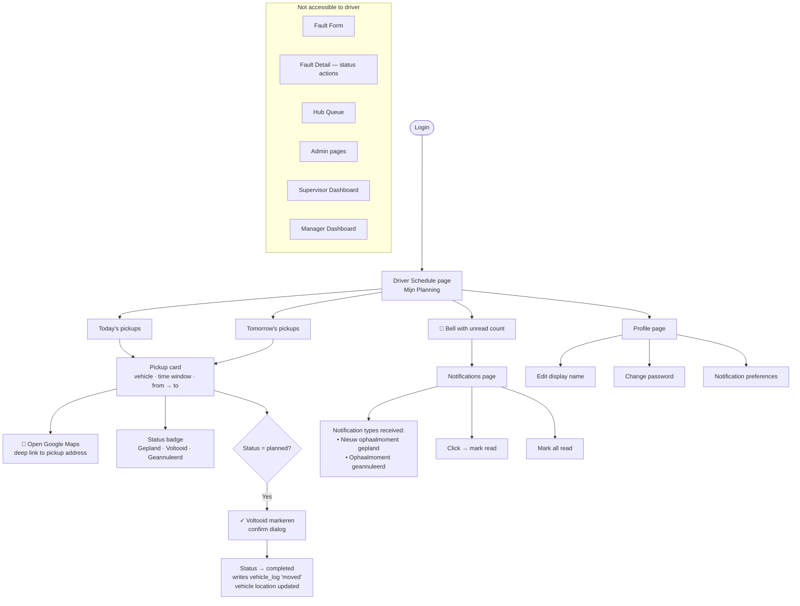

# Driver (Chauffeur) Workflow

```mermaid
flowchart TD
    LOGIN([Login]) --> SCHED[Driver Schedule page\nMijn Planning]

    SCHED --> TODAY[Today's pickups]
    SCHED --> TOMORROW[Tomorrow's pickups]

    TODAY --> PICKUP_CARD[Pickup card\nvehicle · time window · from → to]
    TOMORROW --> PICKUP_CARD

    PICKUP_CARD --> MAPS_LINK[📍 Open Google Maps\ndeep link to pickup address]
    PICKUP_CARD --> STATUS_BADGE[Status badge\nGepland · Voltooid · Geannuleerd]

    PICKUP_CARD --> COMPLETE{Status = planned?}
    COMPLETE -- Yes --> COMPLETE_BTN[✓ Voltooid markeren\nconfirm dialog]
    COMPLETE_BTN --> COMPLETED[Status → completed\nwrites vehicle_log 'moved'\nvehicle location updated]

    %% Notifications
    SCHED --> NOTIF[🔔 Bell with unread count]
    NOTIF --> NOTIF_PAGE[Notifications page]
    NOTIF_PAGE --> NOTIF_TYPES[Notification types received:\n• Nieuw ophaalmoment gepland\n• Ophaalmoment geannuleerd]
    NOTIF_PAGE --> MARK_READ[Click → mark read]
    NOTIF_PAGE --> MARK_ALL[Mark all read]

    %% Profile
    SCHED --> PROFILE[Profile page]
    PROFILE --> EDIT_NAME[Edit display name]
    PROFILE --> CHANGE_PW[Change password]
    PROFILE --> NOTIF_PREFS[Notification preferences]

    %% What driver does NOT see
    subgraph NO_ACCESS [Not accessible to driver]
        direction LR
        NA1[Fault Form]
        NA2[Fault Detail — status actions]
        NA3[Hub Queue]
        NA4[Admin pages]
        NA5[Supervisor Dashboard]
        NA6[Manager Dashboard]
    end
```
