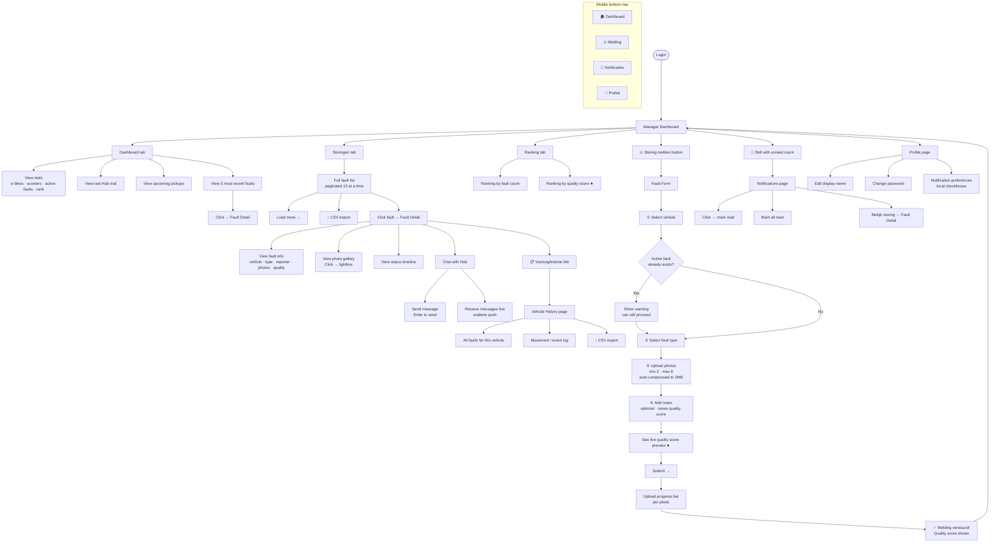

# Manager Workflow

```mermaid
flowchart TD
    LOGIN([Login]) --> DASH[Manager Dashboard]

    DASH --> TAB_DASH[Dashboard tab]
    DASH --> TAB_FAULTS[Storingen tab]
    DASH --> TAB_RANK[Ranking tab]

    %% Dashboard tab
    TAB_DASH --> STATS[View stats\ne-bikes · scooters · active faults · rank]
    TAB_DASH --> HUB_VISIT[View last Hub visit]
    TAB_DASH --> UPCOMING[View upcoming pickups]
    TAB_DASH --> RECENT[View 3 most recent faults]
    RECENT --> FAULT_LINK[Click → Fault Detail]

    %% Storingen tab
    TAB_FAULTS --> FAULT_LIST[Full fault list\npaginated 15 at a time]
    FAULT_LIST --> LOAD_MORE[Load more →]
    FAULT_LIST --> CSV_EXPORT[↓ CSV export]
    FAULT_LIST --> FAULT_DETAIL[Click fault → Fault Detail]

    %% Ranking tab
    TAB_RANK --> RANK_FAULTS[Ranking by fault count]
    TAB_RANK --> RANK_QUALITY[Ranking by quality score ★]

    %% Fault Detail (read + chat)
    FAULT_DETAIL --> VIEW_INFO[View fault info\nvehicle · type · reporter · photos · quality]
    FAULT_DETAIL --> VIEW_PHOTOS[View photo gallery\nClick → lightbox]
    FAULT_DETAIL --> VIEW_STATUS[View status timeline]
    FAULT_DETAIL --> CHAT[Chat with Hub]
    FAULT_DETAIL --> VEHICLE_HIST[📋 Voertuighistorie link]

    CHAT --> SEND_MSG[Send message\nEnter to send]
    CHAT --> RECEIVE_MSG[Receive messages live\nrealtime push]

    %% Report a fault
    DASH --> REPORT_BTN[⚠ Storing melden button]
    REPORT_BTN --> FORM[Fault Form]

    FORM --> SELECT_VEH[① Select vehicle]
    SELECT_VEH --> WARN_DUP{Active fault\nalready exists?}
    WARN_DUP -- Yes --> WARN[Show warning\ncan still proceed]
    WARN_DUP -- No --> SELECT_TYPE

    WARN --> SELECT_TYPE[② Select fault type]
    SELECT_TYPE --> UPLOAD_PHOTOS[③ Upload photos\nmin 2 · max 8\nauto-compressed to 2MB]
    UPLOAD_PHOTOS --> ADD_NOTES[④ Add notes\noptional · raises quality score]
    ADD_NOTES --> LIVE_SCORE[See live quality score preview ★]
    LIVE_SCORE --> SUBMIT[Submit →]
    SUBMIT --> PROGRESS[Upload progress bar\nper photo]
    PROGRESS --> SUCCESS[✅ Melding verstuurd!\nQuality score shown]
    SUCCESS --> DASH

    %% Vehicle history
    VEHICLE_HIST --> VH[Vehicle History page]
    VH --> VH_FAULTS[All faults for this vehicle]
    VH --> VH_LOG[Movement / event log]
    VH --> VH_CSV[↓ CSV export]

    %% Notifications
    DASH --> NOTIF_BELL[🔔 Bell with unread count]
    NOTIF_BELL --> NOTIF_LIST[Notifications page]
    NOTIF_LIST --> MARK_READ[Click → mark read]
    NOTIF_LIST --> MARK_ALL[Mark all read]
    NOTIF_LIST --> FAULT_LINK2[Bekijk storing → Fault Detail]

    %% Profile
    DASH --> PROFILE[Profile page]
    PROFILE --> EDIT_NAME[Edit display name]
    PROFILE --> CHANGE_PW[Change password]
    PROFILE --> NOTIF_PREFS[Notification preferences\nlocal checkboxes]

    %% Mobile nav (manager only)
    subgraph MOBILE [Mobile bottom nav]
        MOB_DASH[🏠 Dashboard]
        MOB_REPORT[⚠ Melding]
        MOB_NOTIF[🔔 Notificaties]
        MOB_PROFILE[👤 Profiel]
    end
```
