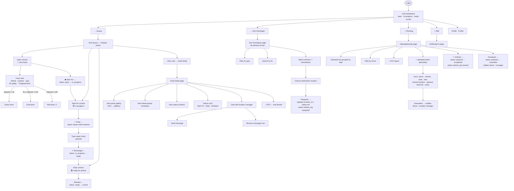

# Mechanic (Hub Monteur) Workflow

```mermaid
flowchart TD
    LOGIN([Login]) --> HUB_DASH[Hub Dashboard\nopen · in-progress · ready counts]

    HUB_DASH --> QUEUE_LINK[→ Queue]
    HUB_DASH --> VEH_LINK[→ Hub Voertuigen]
    HUB_DASH --> SCHED_LINK[→ Planning]

    %% Queue / Kanban
    QUEUE_LINK --> QUEUE[Hub Queue — Kanban board]
    QUEUE --> COL_OPEN[Open column\n🔴 new faults]
    QUEUE --> COL_PROG[Start Fix column\n🟡 in progress]
    QUEUE --> COL_READY[Klaar column\n🟢 ready for pickup]

    COL_OPEN --> CARD[Fault card\nvehicle · location · type\n★ quality · ⏱ elapsed time]
    CARD -- "elapsed < 4h" --> GREEN_AGE[Green timer]
    CARD -- "4h ≤ elapsed < 24h" --> GOLD_AGE[Gold timer]
    CARD -- "elapsed ≥ 24h" --> RED_AGE[Red timer ⚠]

    COL_OPEN --> START_FIX[▶ Start Fix →\nstatus: open → in_progress]
    START_FIX --> COL_PROG

    COL_PROG --> KLAAR_BTN[✓ Klaar →\nopens repair notes textarea]
    KLAAR_BTN --> REPAIR_NOTES[Type repair notes\noptional]
    REPAIR_NOTES --> CONFIRM[✓ Bevestigen →\nstatus: in_progress → ready]
    CONFIRM --> COL_READY

    COL_READY --> AFSLUITEN[Afsluiten →\nstatus: ready → closed]

    QUEUE --> FAULT_DETAIL_LINK[Click card → Fault Detail]

    %% Fault Detail
    FAULT_DETAIL_LINK --> FAULT_DETAIL[Fault Detail page]
    FAULT_DETAIL --> VIEW_PHOTOS[View photo gallery\nClick → lightbox]
    FAULT_DETAIL --> VIEW_SCHEDULE[View linked pickup schedules]
    FAULT_DETAIL --> VIEW_TIMELINE[View status timeline]
    FAULT_DETAIL --> STATUS_CARD[Status card\nStart Fix · Klaar · Afsluiten]
    FAULT_DETAIL --> CHAT_HUB[Chat with location manager]
    FAULT_DETAIL --> PDF_CHAT[↓ PDF — chat thread]

    CHAT_HUB --> SEND[Send message]
    CHAT_HUB --> RECEIVE[Receive messages live]

    %% Hub Vehicles
    VEH_LINK --> HUB_VECH[Hub Voertuigen page\nall vehicles at hub]
    HUB_VECH --> FILTER_TYPE[Filter by type]
    HUB_VECH --> SEARCH_ID[Search by ID]
    HUB_VECH --> SELECT_VEH[Select vehicles ✓ checkboxes]
    SELECT_VEH --> PICK_DEST[Choose destination location]
    PICK_DEST --> ASSIGN[Toewijzen →\nupdates location_id + status=ok\nwrites vehicle_log 'assigned']

    %% Planning
    SCHED_LINK --> PLANNING[Ophaalplanning page]
    PLANNING --> SCHED_LIST[Schedule list grouped by date]
    PLANNING --> FILTER_DRIVER[Filter by driver]
    PLANNING --> SCHED_CSV[↓ CSV export]
    PLANNING --> CREATE_SCHED[+ Ophaalmoment aanmaken]

    CREATE_SCHED --> SCHED_FORM[Form: driver · vehicle · date · time\nfrom/to location · optional fault link · notes]
    SCHED_FORM --> SUBMIT_SCHED[Aanmaken → notifies driver + location manager]

    PLANNING --> COMPLETE_BTN[✓ Voltooid →\nstatus: planned → completed\nwrites vehicle_log 'moved']
    PLANNING --> CANCEL_BTN[Annuleren →\nstatus: planned → cancelled\nnotifies driver + manager]

    %% Notifications
    HUB_DASH --> NOTIF[🔔 Bell]
    NOTIF --> NOTIF_PAGE[Notifications page]

    %% Profile
    HUB_DASH --> PROFILE[Profile · Profiel]
```
