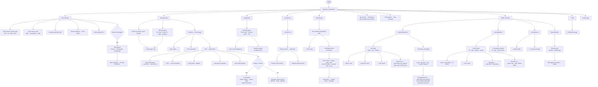

# Supervisor Workflow

```mermaid
flowchart TD
    LOGIN([Login]) --> SUP_DASH[Supervisor Dashboard]

    SUP_DASH --> TAB_OV[Overzicht tab]
    SUP_DASH --> TAB_FAULT[Storingen tab]
    SUP_DASH --> TAB_RANK[Ranking tab]
    SUP_DASH --> TAB_LOC[Locaties tab]
    SUP_DASH --> TAB_PLAN[Planning tab]

    %% Overzicht
    TAB_OV --> FLEET[Fleet totals by vehicle type\ntotal · ok · fault counts]
    TAB_OV --> ACTIVE_CNT[Active fault counts\nopen · in_progress · ready]
    TAB_OV --> AVG_RES[Average resolution time]
    TAB_OV --> RECENT_FAULTS[Recent faults list → Fault Detail]
    TAB_OV --> HUB_INV[Hub inventory list]
    TAB_OV --> SHORTAGE{Reserve shortages?}
    SHORTAGE -- Yes --> SHORT_LIST[Shortage list\nlocation · vehicle type · actual/target]
    SHORT_LIST --> DRILL_CLICK[Click shortage → Locaties drill-down]

    %% Storingen
    TAB_FAULT --> SEARCH[Search by vehicle / type / location]
    TAB_FAULT --> STATUS_FILTER[Filter by status\nAll · Open · Start Fix · Klaar · Gesloten]
    SEARCH --> RESET_PAGE[resets page to 20]
    STATUS_FILTER --> RESET_PAGE
    TAB_FAULT --> FAULT_LIST[Fault list — 20 per page]
    FAULT_LIST --> LOAD_MORE[Meer laden →]
    FAULT_LIST --> FAULT_CSV[↓ CSV exporteren]
    FAULT_LIST --> FAULT_DETAIL[Click → Fault Detail]

    %% Fault Detail (supervisor capabilities)
    FAULT_DETAIL --> READ_CHAT[Read chat thread\nread-only — cannot send]
    FAULT_DETAIL --> PDF_CHAT[↓ PDF — print chat thread]
    FAULT_DETAIL --> VIEW_PHOTOS[View photos · lightbox]
    FAULT_DETAIL --> VIEW_SCHED[View linked schedules]
    FAULT_DETAIL --> VIEW_TIMELINE[View status timeline]
    FAULT_DETAIL --> REOPEN{Status = closed?}
    REOPEN -- Yes --> REOPEN_BTN[↩ Heropenen\nconfirm dialog → status: open\nnotifies mechanics]
    REOPEN -- No --> STATUS_ACTIONS[Mechanic status actions\nStart Fix · Klaar · Afsluiten]

    %% Ranking
    TAB_RANK --> PERIOD[Period selector\nThis month · Previous month · YTD]
    PERIOD --> RANK_FAULTS[Fault count leaderboard]
    PERIOD --> RANK_QUAL[Quality average leaderboard ★]

    %% Locaties
    TAB_LOC --> LOC_LIST[Location list]
    LOC_LIST --> DRILL[Select location → drill-down]
    DRILL --> DRILL_FAULTS[Faults for that location]
    DRILL --> DRILL_VEH[Vehicles at that location]

    %% Planning
    TAB_PLAN --> PLAN_LIST[All schedules grouped by date]
    PLAN_LIST --> PLAN_CSV[↓ CSV export]
    PLAN_LIST --> CREATE_PICKUP[+ Ophaalmoment aanmaken]
    CREATE_PICKUP --> SCHED_FORM[Form: driver · vehicle · date · time\nfrom/to location · optional fault · notes]
    SCHED_FORM --> SUBMIT[Aanmaken → notifies driver + manager]

    %% Hub access (same as mechanic)
    SUP_DASH --> QUEUE[Queue link → Hub Queue\nsame kanban as mechanic]
    SUP_DASH --> HUB_PLAN[Planning link → Hub Schedule]

    %% Admin
    SUP_DASH --> ADMIN_NAV[Admin nav strip]
    ADMIN_NAV --> ADMIN_USERS[Gebruikersbeheer]
    ADMIN_NAV --> ADMIN_LOC[Locatiebeheer]
    ADMIN_NAV --> ADMIN_VEH[Voertuigbeheer]
    ADMIN_NAV --> ADMIN_RES[Reservebeheer]

    %% Admin Users
    ADMIN_USERS --> USER_TABLE[User table\nname · role · location]
    USER_TABLE --> ROLE_FILTER[Filter by role]
    USER_TABLE --> NAME_SEARCH[Search by name]
    USER_TABLE --> USER_CSV[↓ CSV export]
    USER_TABLE --> DEACTIVATE[Deactiveren →\ncalls admin-user edge fn\nbans user for 100 years]
    ADMIN_USERS --> INVITE_FORM[+ Gebruiker uitnodigen]
    INVITE_FORM --> INVITE_FIELDS[email · full name · role · location optional]
    INVITE_FIELDS --> SEND_INVITE[Uitnodiging sturen →\ncalls admin-user edge fn\nuser receives email with password setup link]

    %% Admin Vehicles
    ADMIN_VEH --> VEH_TABLE[Vehicle table\nID · type · location · status]
    VEH_TABLE --> VEH_FILTERS[Type + status filters · ID search]
    VEH_TABLE --> VEH_CSV[↓ CSV export]
    VEH_TABLE --> EDIT_VEH[Bewerken →\nedit color + notes inline]
    VEH_TABLE --> RETIRE[Pensioneren →\nstatus: hub · notes: Buiten dienst]
    ADMIN_VEH --> ADD_VEH[+ Voertuig toevoegen\nID · type · start location]

    %% Admin Locations
    ADMIN_LOC --> LOC_TABLE[Location table]
    ADMIN_LOC --> ADD_LOC[+ Locatie toevoegen]

    %% Admin Reserves
    ADMIN_RES --> RES_GRID[Reserve grid\nlocation × vehicle type]
    RES_GRID --> EDIT_TARGET[Edit target count inline → upsert]

    %% Notifications
    SUP_DASH --> NOTIF[🔔 Bell]
    NOTIF --> NOTIF_PAGE[Notifications page]

    %% Profile
    SUP_DASH --> PROFILE[Profile page]
```
